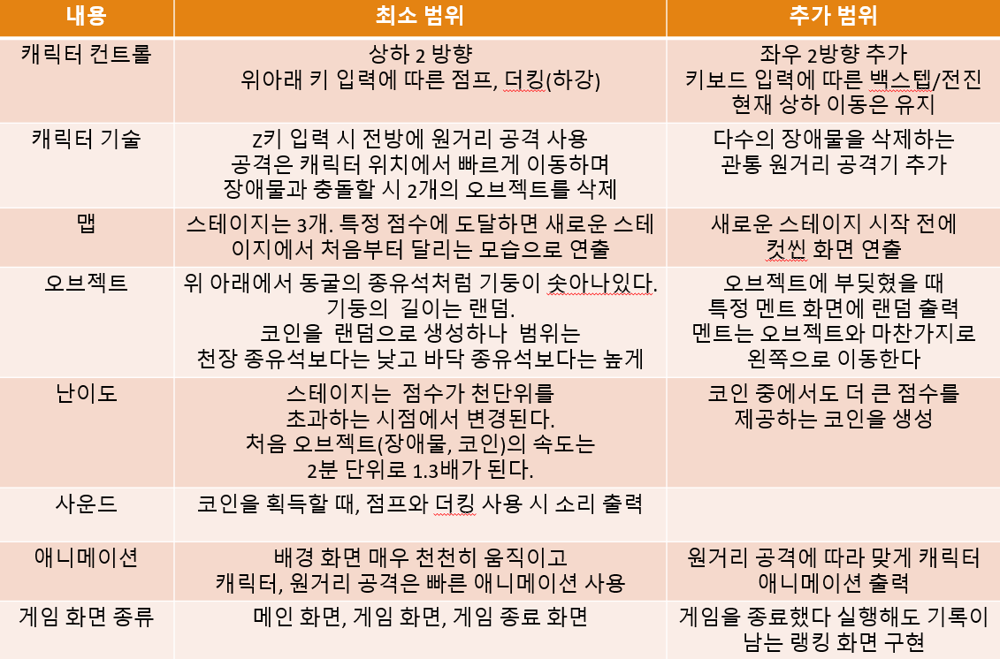
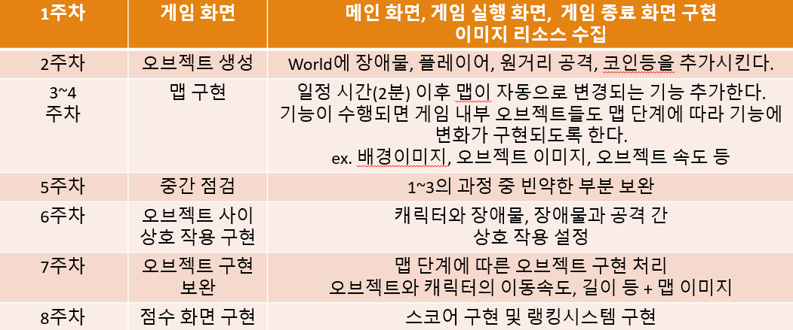
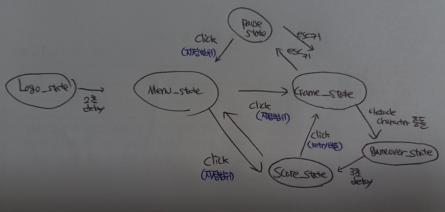
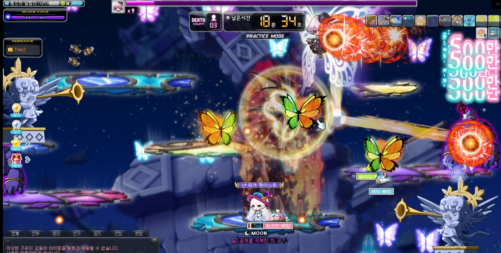
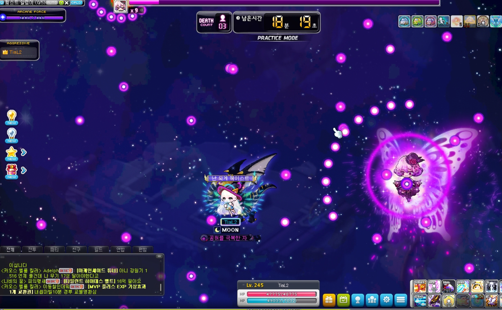
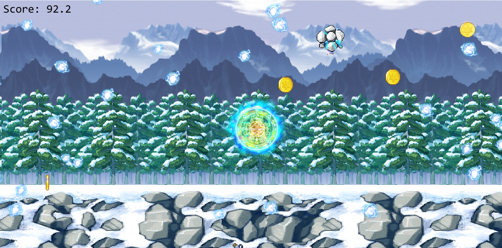
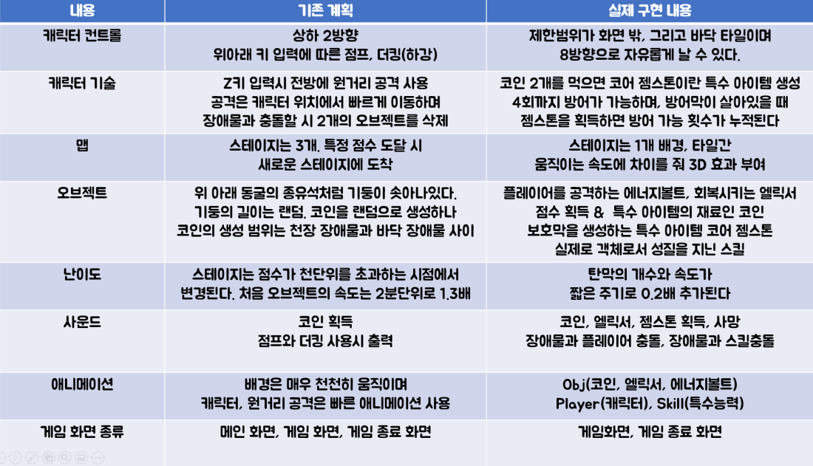
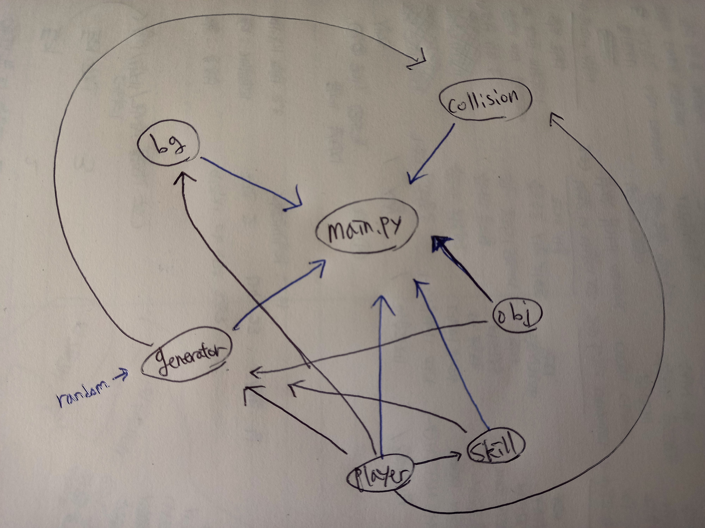
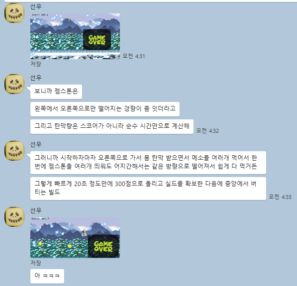
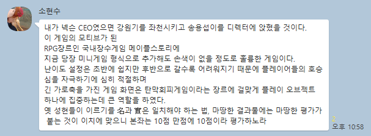

2d 기말 과제 계획서
===================
# 게임소개
1. 제목   
<2d run sim>
2. copy game / 원 게임 정보 / 스크린샷   
<레바런> / 장애물을 점프, 숙이기 등을 활용해 장애물을 피하고 치킨(코인)을 획득한다. / 
3. 게임의 목적, 방법 등 간단한 설명   
점프기능과 점프를 위한 장애물을 우선적으로 구현하고, 구현이 완료되면 장애물 종류를 더하고 액션의 가짓수를 더한다 (ex.슬라이드, 빅점프, 장애물 파괴 공격)   
장애물 여러가지 구현이 완료되면 코인을 구현하고, 획득하는 코인 수를 화면 위에 or 게임이 끝나고 나오는 gameover_state에 표시한다.
## GameState(scene)의 수 및 각각의 이름
총 5개
logo_state / title_state / stage1_state / stage2_state / pause_state
## 각 GameState별 다음항목 
1. 한줄 설명   
logo_state : 로고 이미지 출력, 일정시간 후 title로 자동이동   
title_state : 타이틀 이미지 출력, (숫자 키패드 1, 2) 입력을 통해 stage1_state or stage2_state로 이동   
stage1_state : stage1에서 출력할 장애물, 코인, 캐릭터, 맵(지면) 등을 출력   
stage2_state : 동일하지만 stage2의 요소로 변경

2. 화면에 표시할 객체 목록   
logo_state : 로고 이미지   
title_state : 타이틀 이미지 출력, stage 선택 문구   
pause_state : 게임 플레이 도중 멈추는 경우 pause문구가 적혀있는 이미지 출력, 현재까지 버틴 시간 출력   
esc 입력받을 경우 기존 stage_state로 이동
stage1_state : stage1의 캐릭터, 장애물, 코인, 맵(지면) 등을 출력   
stage2_state : stage1의 객체와 동일하나 2의 버전으로

3. 처리할 키/마우스 이벤트   
logo_state : 일정 시간 후 자동으로 title_state로 이동한다. 프로그램의 x창 및 키보드 ESC 버튼을 입력받으면 프로그램 종료.   
title_state : x창 마우스클릭, 키보드 ESC 입력받을시 프로그램 종료 / 숫자 1 입력 시 stage1_state, 2 입력 시 stage2_state 호출   
pause_state : 키보드 esc 입력받을 시 기존 스테이지로 이동
stage1_state : stage1에서 출력할 장애물, 코인, 캐릭터, 맵(지면) 등을 출력   
stage2_state : 동일하지만 stage2의 요소로 변경

4. 다른 state로 이동한다면 , 각 이동에 대한 조건 및 방법 (다이어그램 형식이면 더 좋다)

## 필요한 기술
1. 다른 과목에서 배운 기술   
C++의 class
2. 이 과목에서 배울것으로 기대되는 기술   
코드가 길어지지 않도록 적절히 분할하고, 적재적소에 분할된 코드들을 사용하는 방법을 익히는 것   
내가 특정하는 이벤트를 제약없이 설정할 수 있는 방법
3. 다루지 않을 것 같아서 수업에서 다루어 달라고 요청할 기술   
- 특정 상황에서(조건에서) 소리를 출력하는 기술   
- 기존에 돌아간 경우가 있다면 기록 저장 (이와 같은 러닝 게임인 경우 프로그램을 껐다 실행해도 랭킹을 기록하는 시스템)   
=> 즉 예전에 실행된 데이터를 삭제할 지 저장할 지 선택할 수 있는 방법을 알고 싶습니다.

# 10/10 추가  
기말과제로 준비하려는 게임은 '쿠키런'의 모작입니다.  
대표적인 러닝게임인 쿠키런과 어느정도 메커니즘의 차이를 두려고 합니다.  
1) 공중 기동이 컨트롤의 메인. 공중에서 제한없이 연속점프가 가능하며, 아래로 빠른 하강이 가능하다. 지면에서 달리는 것이 가능하고, 천장에 부딪히면 캐릭터는 빠른 속도로 낙하한다.  
2) 플레이어의 x좌표가 고정되지 않습니다. 후진 / 전진스텝을 여러번 밟는것이 가능하며, y축 움직임은 유지한채로 x좌표를 살짝 이동합니다.  

## 게임 개발 범위  
  

## 게임 개발 계획

## 게임 스테이트 비주얼

# 12/04 추가  
# 기존 계획이 잘 진행되지 않아 게임 컨셉을 전면적으로 변경
# 게임 소개  
1. 제목   
<maple_boss_minigame>  
2. copy game / 원 게임 정보 / 스크린샷   
<메이플스토리> / 보스 <루시드>의 특수 패턴  
  
  
## 게임 플레이 화면  
  
3. 게임의 목적, 방법 등 간단한 설명   
 최대한 오래 살아남는 것이 목적  
 오브젝트로는 에너지볼트(탄막), 엘릭서(회복아이템/max_hp라면 점수 획득), 코인(특수아이템 재료/점수 획득)  
 코어젬스톤(특수아이템) : 탄막을 일정횟수 방어하는 방어막을 생성. 젬스톤을 획득하면 보호막이 중첩됨  
## GameState(scene)의 수 및 각각의 이름  
총 7개  
main.py / collision.py, generator.py, player.py, obj.py, skill.py (오른순으로 import시킨 모듈이 많음)  
## 각 GameState별 다음항목  
1. 한줄 설명  
main.py : 모듈 총괄  
obj.py : 탄막, 코인, 회복아이템, 특수아이템을 class 형태로 관리  
skill.py : 스킬들을 class 형태로 관리  
player.py : 라이프, 플레이어 좌표, 젬스톤 생성스택(코인 획득 누적횟수), 스킬 방어스택 (방어막 누적횟수) 관리  
+ 스킬을 생성할 때 generator에게 플레이어 좌표를 전달한다.  
generator.py : 플레이어, 스킬, 오브젝트를 어떤 조건에 생성할 지 결정  
+ 난이도 관리 함수가 존재  
collision.py : 객체들간 충돌을 관리, generator.py에 충돌 사실 전달  
2. 화면에 표시할 객체 목록  
오브젝트: 에너지볼트(탄막), 코인(점수, 특수아이템 재료), 엘릭서(회복 아이템), 코어젬스톤(특수 아이템)  
플레이어: 플레이어 + 플레이어 주변 날개 이펙트  
스킬: 스킬리스트 (에테리얼 폼, 인레이지)  
3. 처리할 키/마우스 이벤트  
방향키 입력으로 이동 / ESC or X창 클릭으로 프로그램 종료  
## 게임성 확보를 위해  
탄막의 궤적은 마름모꼴로 발사되며 점점 플레이어를 중앙으로 고립시킨다. 그중 일부 탄막은 플레이어가 있을 중앙을 향한다.  
초반에 코인을 많이 획득해 방어막을 중첩시키면 점수와 방어막 횟수를 크게 늘릴 수 있다. 초반 플레이가 이후 플레이에 미칠 영향이 크다.  
따라서 코인은 중앙을 향해 가는 빈도가 많도록 조정한다. 스킬 이펙트는 2가지 준비해 그 중 랜덤으로 하나가 출력된다.  
## 기존 계획 & 실제 구현 내용  
  
## 게임 스테이트 비주얼  
  
## 게임 제작 과정 중 어려움
1. 게임 난이도 관리 함수에서 보호막 최대 방어 횟수도 서서히 늘리고 싶었지만 방법을 찾지 못함  
2. 오디오 버그가 자주 터져서 wav파일과 mp3파일을 교차하며 사용했음  
이유는 모르겠지만 main.py 이외의 py파일에 wav,mp3파일의 로드 명령어가 통하질 않음
3. obj 궤적 수정에 어려움이 있었다. dx,dy의 절대값을 일정이하가 되면 속도는 만족스럽지만 화면 중앙으로 이동하는 obj가  
거의 없고, 절대값을 일정이상 유지하면 화면 중앙으로 가는 obj가 많이 생기나 속도가 굉장히 느리다.  
x/y += (dx/dy * obj의 frame속도 * obj의 self.speed)
4. 소리 크기를 조정하는것이 까다로웠다. 소리가 너무 커서 작게 조정했는데 참여자들은 노래가 굉장히 작게 들린다는 듯  

## 주변인 평가  
친구 1  
다른 탄막들에 비해 젬스톤(특수 아이템) 생성위치와 궤도와 확실히 보여서 좋다. 젬스톤이 불규칙하게 떨어졌으면 훨씬 어려웠을 것이다. 탄막량은 스코어가 아니라 시간에 의존한다.  그래서 초반에 코인을 빠르게 먹어 방어막 파밍을 하면 오래 버틸 수 있었다. 빌드 찾는 재미가 있다. 8점.
  
친구 2  
소리 크기가 너무 작은 거 같다. 난이도 조절이 마음에 든다. 호승심을 적당하게 자극함. 장르와 걸맞게 긴 가로축을 쓴 것이  
마음에 들고 탄막 게임답게 플레이 오브젝트 하나에만 집중할 수 있었다. 실제 메이플 보스 패턴과 상당히 비슷해 연습할수도 있을듯? 10점.

