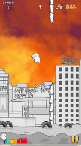

2d 기말 과제 계획서
===================
# 게임소개
1. 제목   
<2d run sim>
2. copy game / 원 게임 정보 / 스크린샷   
<레바런> / 장애물을 점프, 숙이기 등을 활용해 장애물을 피하고 치킨(코인)을 획득한다. / 
3. 게임의 목적, 방법 등 간단한 설명   
점프기능과 점프를 위한 장애물을 우선적으로 구현하고, 구현이 완료되면 장애물 종류를 더하고 액션의 가짓수를 더한다 (ex.슬라이드, 빅점프, 장애물 파괴 공격)   
장애물 여러가지 구현이 완료되면 코인을 구현하고, 획득하는 코인 수를 화면 위에 or 게임이 끝나고 나오는 gameover_state에 표시한다.
## GameState(scene)의 수 및 각각의 이름
logo_state / title_state / stage1_state / stage2_state
## 각 GameState별 다음항목 
1. 한줄 설명   
logo_state : 로고 이미지 출력, 일정시간 후 title로 자동이동   
title_state : 타이틀 이미지 출력, (숫자 키패드 1, 2) 입력을 통해 stage1_state or stage2_state로 이동   
stage1_state : stage1에서 출력할 장애물, 코인, 캐릭터, 맵(지면) 등을 출력   
stage2_state : 동일하지만 stage2의 요소로 변경

2. 화면에 표시할 객체 목록   
logo_state : 로고 이미지   
title_state : 타이틀 이미지 출력, stage 선택 문구   
pause_state : 게임 플레이 도중 멈추는 경우 pause문구가 적혀있는 이미지 출력, 현재까지 버틴 시간 출력   
esc 입력받을 경우 기존 stage_state로 이동
stage1_state : stage1의 캐릭터, 장애물, 코인, 맵(지면) 등을 출력   
stage2_state : stage1의 객체와 동일하나 2의 버전으로

3. 처리할 키/마우스 이벤트   
logo_state : 일정 시간 후 자동으로 title_state로 이동한다. 프로그램의 x창 및 키보드 ESC 버튼을 입력받으면 프로그램 종료.   
title_state : x창 마우스클릭, 키보드 ESC 입력받을시 프로그램 종료 / 숫자 1 입력 시 stage1_state, 2 입력 시 stage2_state 호출   
pause_state : 키보드 esc 입력받을 시 기존 스테이지로 이동
stage1_state : stage1에서 출력할 장애물, 코인, 캐릭터, 맵(지면) 등을 출력   
stage2_state : 동일하지만 stage2의 요소로 변경

4. 다른 state로 이동한다면 , 각 이동에 대한 조건 및 방법 (다이어그램 형식이면 더 좋다)
## 필요한 기술
1. 다른 과목에서 배운 기술   
2. 이 과목에서 배울것으로 기대되는 기술   
코드가 길어지지 않도록 적절히 분할하고, 적재적소에 분할된 코드들을 사용하는 방법을 익히는 것   
내가 특정하는 이벤트를 제약없이 설정할 수 있는 방법
3. 다루지 않을 것 같아서 수업에서 다루어 달라고 요청할 기술   
- 특정 상황에서(조건에서) 소리를 출력하는 기술   
- 기존에 돌아간 경우가 있다면 기록 저장 (이와 같은 러닝 게임인 경우 프로그램을 껐다 실행해도 랭킹을 기록하는 시스템)   
=> 즉 예전에 실행된 데이터를 삭제할 지 저장할 지 선택할 수 있는 방법을 알고 싶습니다.
